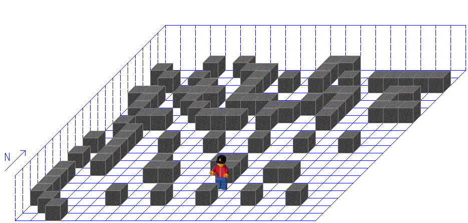
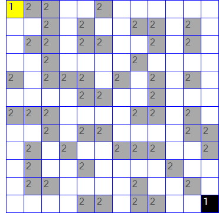

# C Gartenzaun Karol

## Dokumentation
- [Karol](api/Karol.yml)
- [Karol.Core](api/Karol.Core.yml)

Hier steht vielleicht mal ein text...

## Screenshots
#### Welt mit 2 Robotern


#### Ein Labyrinth


#### 2D Ansicht


## Beispiel Code
#### Erstellen einer Welt mit Roboter
```C#
World world = new World(10, 5, 10);
Robot adam = new Robot(3, 2, world, Direction.South);
```

#### Roboter baut eine Wand
```C#
World world = new World(10, 5, 10);
Robot sandler = new Robot(0, 0, world);

sandler.Delay = 10; // Damit es nich so lang dauert...

while (sandler.Position.Y < world.Height - 1)
{
    if (sandler.HasWall)
    {
        sandler.TurnRight();
    }

    sandler.Place();
    sandler.Move();
}
```

#### Intelligentes l&ouml;sen eines Labyrinths
```C#
World world = World.Load("Pfad zu Welt Datei");
Robot egon34 = world.Robots[0]; // Erster Roboter in der Welt
Random rand = new Random();     // Zufallszahlen generator

egon34.Delay = 0; // Damit es nich so lang dauert...

while (!egon34.HasMark)
{
    if (!egon34.HasWall)
    {
        egon34.Move();
    }

    int num = rand.Next(100);
    if (num <= 30)
    {
        egon34.TurnLeft();
    }
    else if (num >= 70)
    {
        egon34.TurnRight();
    }
}
```