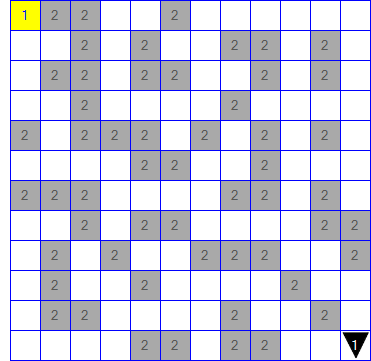

# C Gartenzaun Karol

## Dokumentation
- [Karol](api/Karol.yml)
- [Karol.Core](api/Karol.Core.yml)

<br>

Mit Karol kann man den Ablauf seines Programmes v.a. Schleifen oder Verzweigungen gut visualisieren.
<br>
PERFEKT f&uuml;r Anf&auml;nger die keine Ahnung von dem haben was sie eigentlich tun...

#### World
In Karol enthalten sind Welten in einer Bestimmten gr&ouml;&szlig;e.
<br>
Diese k&ouml;nnen alles von Robotern die herrumlaufen bis hin zu Marken auf dem Boden enthalten.
<br>
Nat&uuml;rlich k&ouml;nnen Welten auch als Datei gespeichert und wieder geladen werden. 
<br>
Auch Welten aus der "&auml;hnlichen" Java Karol Bibliothek sind beim Laden Kompatibel.

#### Robot
Roboter M&uuml;SSEN innerhalb einer Welt Leben! Ihre existenz ist ohne diese nicht m&ouml;glich.
<br>
Nach der erzeugung einer Welt k&ouml;nnen in dieser bis zu 2147483647 Roboter platziert werden.
<br>
Diese k&ouml;nnen dann &uuml;ber den Geschriebenen Code oder &uuml;ber den Intigrierten Controller gesteuert werden.
<br>
Vrosicht! 
<br>
Roboter die gegen W&auml;nde, andere Roboter oder zu hohe T&uuml;rme laufen werden alles Vernichten (eine Exception werfen)!

Roboter k&ouml;nnen...
- Gehen
- Ziegel plazieren oder aufheben
- Marken platzieren oder aufheben
- Quader platzieren oder aufheben
- Merken ob sie sich auf einer Marke, vor einer Wand, einem Ziegel oder einem Anderen Roboter befinden
- Tolle Ger&auml;usche machen
- Nicht in andere Roboter laufen
- Fatale Exceptions werfen

#### RobotOptions
Mithilfe der RobotOptions k&ouml;nnen Roboter von begin an nach Ihren W&uuml;nschen gestalten werden.
<br>
Nicht nur standard werte wie Blickrichtung, Position oder Delay lassen sich hier &auml;ndern,
<br>
sondern sogar das aussehen des Roboters kann selbst bestimmt werden (Nur so lange der Vorrat reicht!).


## Screenshots
#### Welt mit 2 Robotern


#### Ein Labyrinth


#### 2D Ansicht


#### Verschiedene Farben


## Beispiel Code
#### Erstellen einer Welt mit Roboter
```C#
World world = new World(10, 5, 10);
Robot adam = new Robot(3, 2, world, Direction.South);
```

#### Roboter baut eine Wand
```C#
World world = new World(10, 5, 10);
Robot sandler = new Robot(0, 0, world);

sandler.Delay = 10; // Damit es nich so lang dauert...

while (sandler.Position.Y < world.Height - 1)
{
    if (sandler.HasWall)
    {
        sandler.TurnRight();
    }

    sandler.Place();
    sandler.Move();
}
```

#### Mehr oder weniger Intelligentes l&ouml;sen eines Labyrinths
```C#
World world = World.Load("Pfad zu Welt Datei"); // Welt Dateiformat .kdw oder .cskw
Robot egon34 = world.GetRobot(0); // Erster Roboter in der Welt
Random rand = new Random();       // Zufallszahlen generator

egon34.Delay = 0; // Damit es nich so lang dauert...

while (!egon34.HasMark)
{
    if (!egon34.HasWall)
    {
        egon34.Move();
    }

    int num = rand.Next(100);
    if (num <= 30)
    {
        egon34.TurnLeft();
    }
    else if (num >= 70)
    {
        egon34.TurnRight();
    }
}
```

#### Markieren des gesammten Bodens
```C#
World world = new World(15, 5, 10);     // Welt erzeugen
Robot robo = new Robot(0, 0, world);    // Roboter an der Position 0, 0, 0 in "world" erzeugen

robo.Delay = 30;    // Damit es nich so lang dauert...

for(int i = 0; i < world.Width; i++)
{
    while (!robo.HasWall)
    {
        robo.PlaceMark();
        robo.Move();
    }

    if (i == world.Width - 1)
        break;

    robo.PlaceMark();

    if (i % 2 == 0)
    {
        robo.TurnRight();
        robo.Move();
        robo.TurnRight();
    }
    else
    {
        robo.TurnLeft();
        robo.Move();
        robo.TurnLeft();
    }
}

robo.PlaceMark();
```

#### Welten k&ouml;nnen auch aus strings geladen werden!
```C#
string str = "C_Gartenzaun_Karol_World\n" +
             "Size: 3,2,3\n" +
             "---  \n" +
             "_ _ R(2)\n" +
             "Q Q _\n" +
             "_ Q Q\n";

MemoryStream stream = new MemoryStream(Encoding.ASCII.GetBytes(str));
World world = World.Load(stream);
```

ergibt folgende Welt...
<br>


<br>
<br>
<i>Written by Daniel M&uuml;ller 12b</i>
